<!---
date : 9/1/2021
author : Daisuke Nakahara <daisuken@microsoft.com>
reviewer : Berry Tsai <betsai@microsoft.com>; Takehiro Hirai <takehiro.hirai@microsoft.com>
Maintainer : 
title : Azure Account Sign up instruction
--->

# Sign up Azure Subscription

Creating an Azure free account is one way to access Azure services. When you start using Azure with a free account, you get $200 credit to spend in the first 30 days after you sign up. In addition, you get free monthly amounts of two groups of services: Popular services, which are free for 12 months, and 25+ other services that are free always. Free services are based on resource and region availability.

If you are a student, you may select Azure Student account, which has slightly different offering.

## Azure Services Pricing Model

Each Azure service has different pricing model.  Many of them includes **Free** SKU.  For example Azure IoT Hub has F1 SKU which is free of charge.

## Azure Free Account vs. Azure for Students

Both Azure Free Account and Azure for Students provides :

- Subscription for 1 year
- Azure Credit
- Access to more than 25 Azure services, both free SKUs and non-free SKUs

Difference are followings:

| Subscription Type  | Azure Credit and spending limits                           | Note                                                                                                                                                                   |
|--------------------|------------------------------------------------------------|------------------------------------------------------------------------------------------------------------------------------------------------------------------------|
| Azure Free Account | $200, must be used within 30 days after account sign up.   | Within 30 days of sign-up or upon exhaustion of the Credits (whichever occurs first), you must upgrade to a Pay-As-You-Go subscription by removing the Spending Limit. |
| Azure for Students | #100, must be used within 12 months after account sign up. | Additional benefits such as software download benefits for education, non-commercial purpose.                                                                          |

> [!IMPORTANT]  
> Make sure you sign up for Azure Free Account or Azure for Students when you are ready.  Your 30 day spending limit timer will start when you sign up.

If you are a student, you can sign up for Azure for Students and enjoy $100 credit for a year.

If you are not a student, you can sign up for Azure Free Account.  Enjoy $200 credit for 30 days.  After 30 days, please upgrade to Pay-as-you-go subscription to continue to use the subscription.  By upgrading to pay-as-you-go subscription, you can continue to use Azure services, including Free SKUs.  If you choose to use non-free SKU, you will be charged based on pricing model of each service you choose to use.

- Azure Free Account FAQ : <https://azure.microsoft.com/free/free-account-faq/>
  Including the list of Free Services
- Azure for Students FAQ : <https://azure.microsoft.com/en-us/offers/ms-azr-0170p/>

> [!TIP]  
> Best practices to avoid accidental Azure Credit spending  
>  
> - Make sure you understand quotas and pricing models  
>   Some services are charged based on CPU usage, some are fixed, etc.
> - Stop services that are not actively in use
> - Delete service instances that are no longer in use
> - Shutdown Virtual Machine while actively not in use

## Azure Free Account sign up

Detailed step by step instruction to sign up for Azure Free Account

### Requirements

- Microsoft Account
- Contact Information
- Credit Card or Debit card

> [!NOTE]  
> Your credit card will NOT be charged, unless you decided to move to Pay-as-you-go subscription.

### Step by step instruction to sign up for Azure Free Account

1. Browse to <https://azure.microsoft.com/free>, then click `Start Free`  
  
    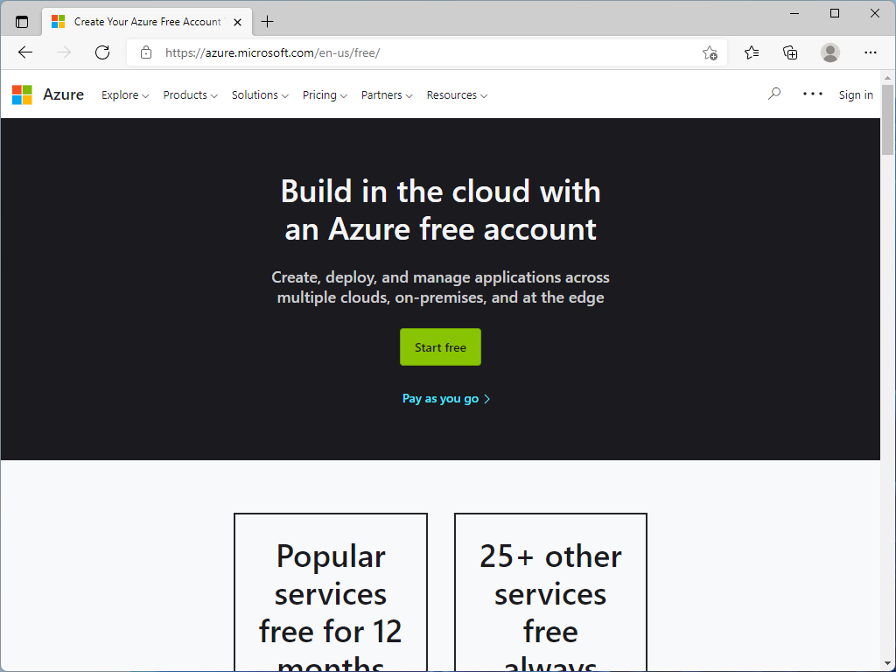

1. To sign up for a new Free Account, sign in using your Microsoft Account

    If you do not have one or would like to use a different email address, click `Create one!`

    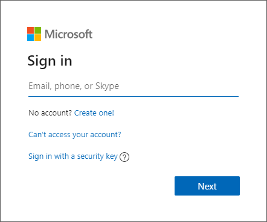

1. Enter your email address to sign in to Microsoft Account

    The email address can be your existing email address such as your work email, shool email, @outlook.com, or @gmail.com etc.

    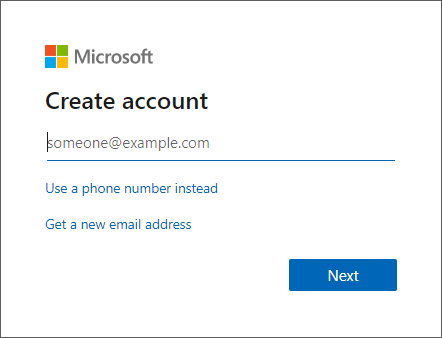

    If you would like to create a new email address, click `Get a new email address` ([Instruction](#creating-a-new-email-address))

1. Please read customer agreement and privacy agreement, then click `Next`

    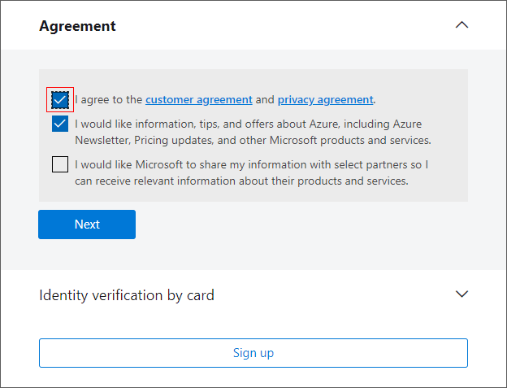

1. Enter Credit Card or Debit Card information  

    > [!NOTE]  
    > Your card will not be charged, unless you decided to upgrade to Pay-As-You-Go subscription.

    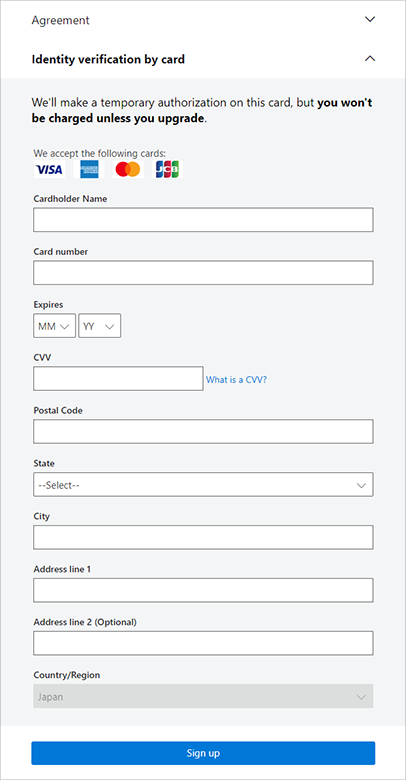

    > [!NOTE]  
    > This process includes verification using SMS or phone call.

1. Once the verification is completed, click `Sign up`

1. Navigate to <https://portal.azure.com> and confirm you can access to your subscription

    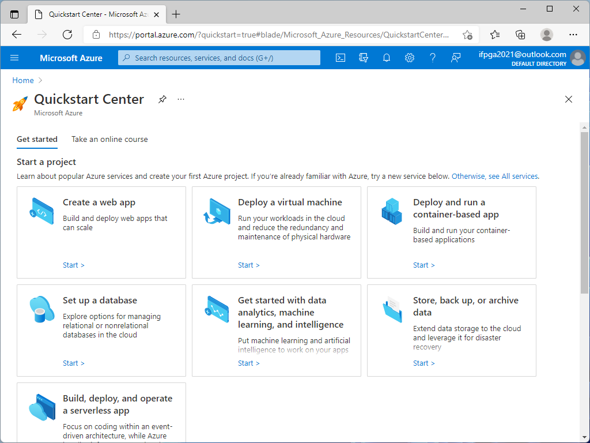

## Azure for Students Sign up

### Requirements for Azure for Students

- Microsoft Account
- School email
- Contact Information

### Step by step instruction to sign up for Azure for Students

1. Navigate to <https://azure.microsoft.com/offers/ms-azr-0170p/>, then click `Apply now`

    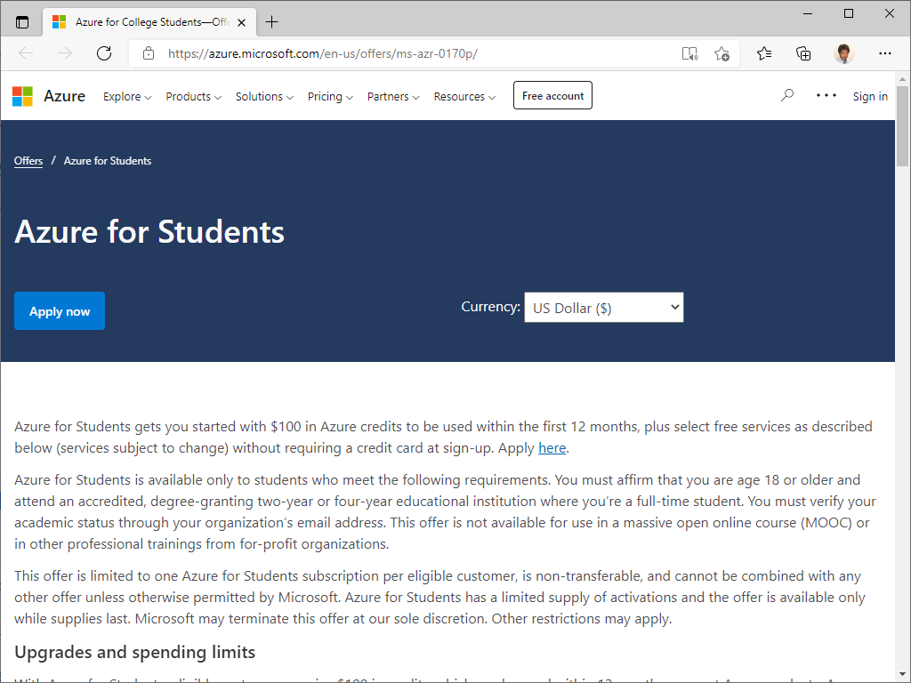

1. Sign in using your Microsoft Account

    If you do not have one or would like to use your school email address, click `Create one!`

    

1. Verify your identity using your phone  

    Enter your phone number then select either `Text me` or `Call me`

    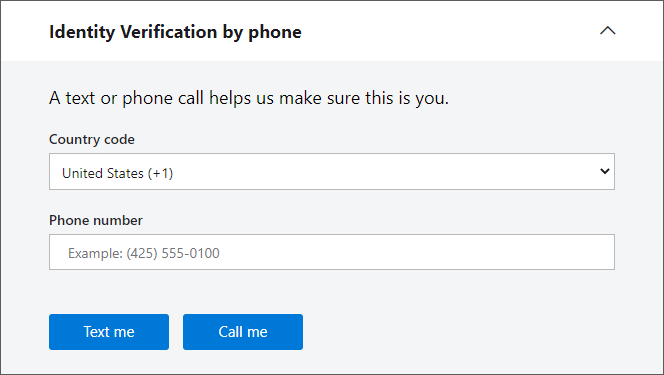

1. Verify your academic status using your shool email address  

    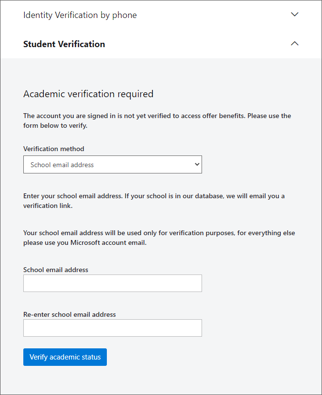

1. Enter your account information and click `Next`  

    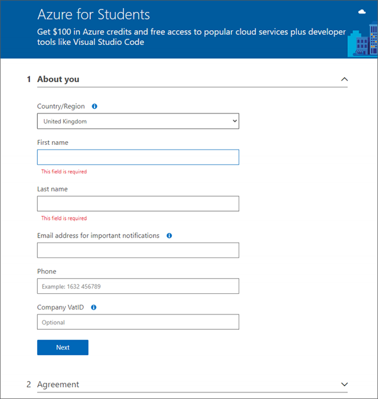

1. Click the agreement check box and click `Sign up`  

    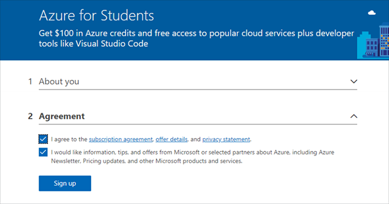

1. It may take a few minutes to set up your subscription

1. Browse to <https://portal.azure.com> to verify your subscription is ready

> [!NOTE]  
> You can check your balance at <https://www.microsoftazuresponsorship.com/balance>

## Creating a new email address

1. Pick a unique email address and domain name (outlook.com or hotmail.com, etc)

    

1. Create a new password  

    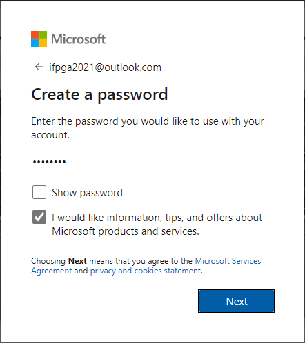

1. Follow the wizard to complete new email account sign up.

    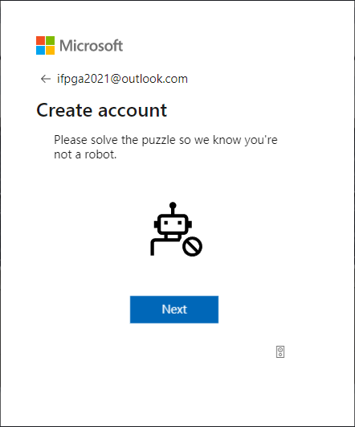

[Back to README](../README.md)
