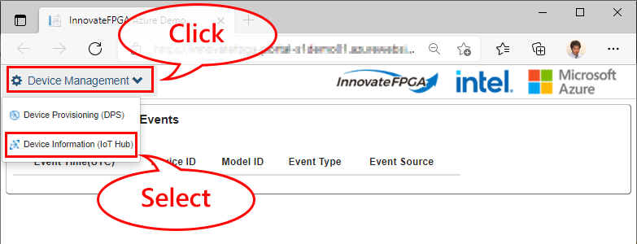
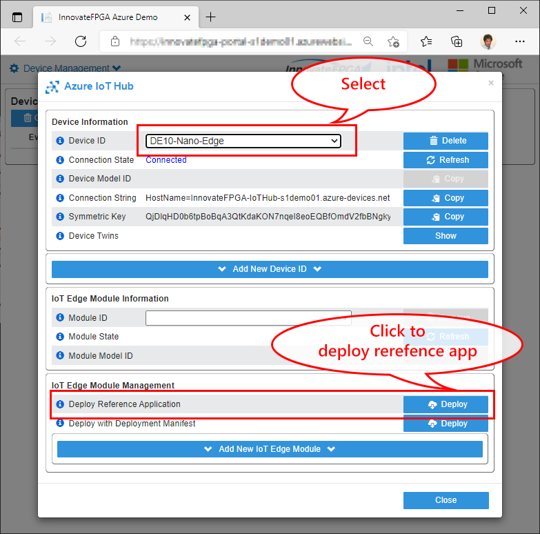
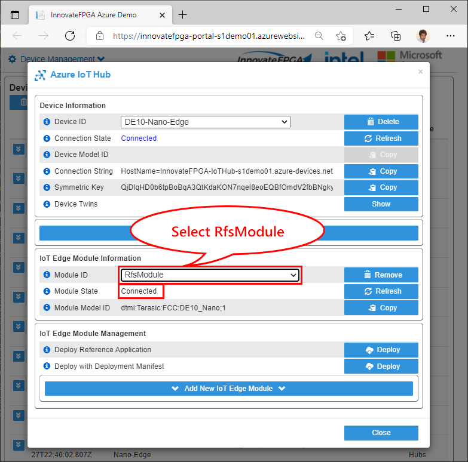
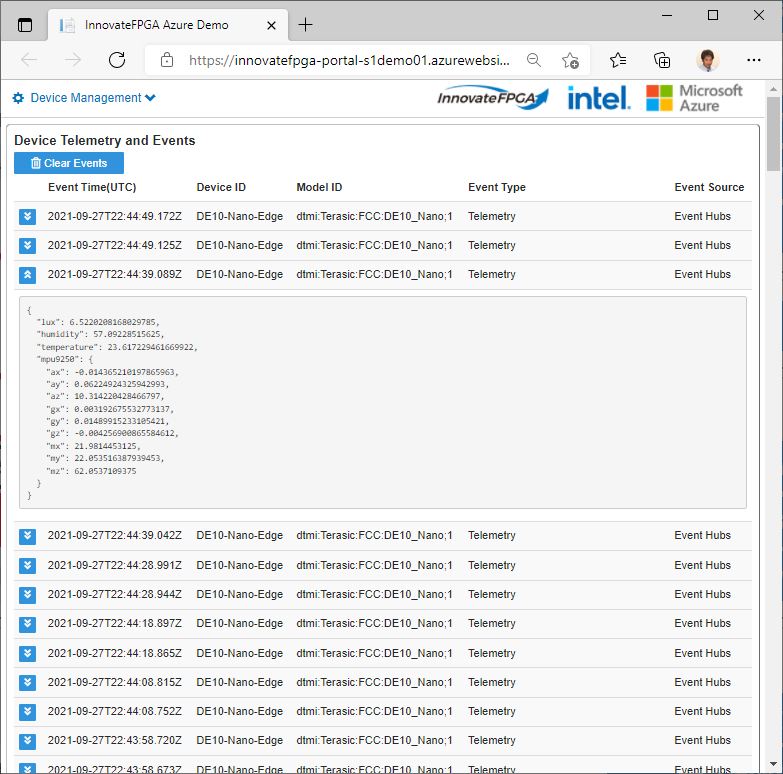

# Deploy Reference Application as Azure IoT Edge module

You DE10-Nano is running Azure IoT Edge Runtime and provisioned to your IoT solution.

Azure IoT Edge provides remote device management including **workloads**.  Workloads are packaged as docker containers and can be deployed to Azure IoT Edge device remotely.  

You can deploy Azure IoT Edge module through various tools such as :

- Azure Portal <https://docs.microsoft.com/en-us/azure/iot-edge/how-to-deploy-modules-portal?view=iotedge-2020-11>
- Azure CLI <https://docs.microsoft.com/en-us/azure/iot-edge/how-to-deploy-modules-cli?view=iotedge-2020-11>
- Visual Studio Code <https://docs.microsoft.com/en-us/azure/iot-edge/how-to-deploy-modules-vscode?view=iotedge-2020-11>

Deployment information, such as which IoT Edge module to deploy and parameters to pass, are done through a JSON file called `deployment manifest`.

More information on Deployment Manifest : <https://docs.microsoft.com/en-us/azure/iot-edge/module-composition?view=iotedge-2020-11>

## Deploy Reference Application

1. Browse to your sample IoT solution
1. From the menu, select `Device Information (IoT Hub)`  

    

1. Click `Deploy` button to deploy reference application  

    

1. `RfsModule` should be listed in the `Module ID` list box  

    > [!CAUTION]  
    > It may take several minutes to deploy module, depending on internet connection speed, etc.

    

1. Verify that telemetry from Reference Application Module are displayed in the sample IoT solution

    

## Completed

Congratulations!  You just deployed Reference Application as IoT Edge module to your DE10-Nano.
Now you can customize device application to receive data for your use cases.

## Next Steps

- [Add IoT Plug and Play interfaces](./DE10-Nano-IoTEdge-Deploy.md)
- [Back to README](../README.md)
